# Future Feed Design Specification

The following document contains design specification for Future Feed. This includes the initial wireframes for the project and the current implementations for demo 3.

## Contents
* [Wireframes](#wireframes-(Initial))
* [Screenshots of Implemented Mobile Pages](#screenshots-of-implemented-pages-(Mobile))

## Wireframes (Initial)
#### Landing page

#### Login page

#### Home page

#### Profile page

## Screenshots of implemented pages (Mobile)
#### Landing page
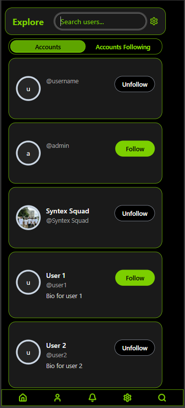

#### Help page
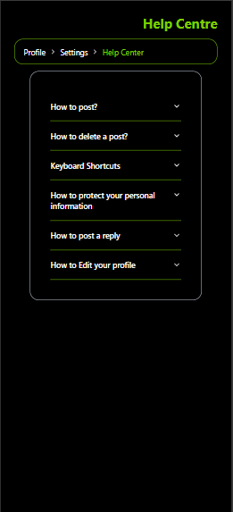

#### Profile page
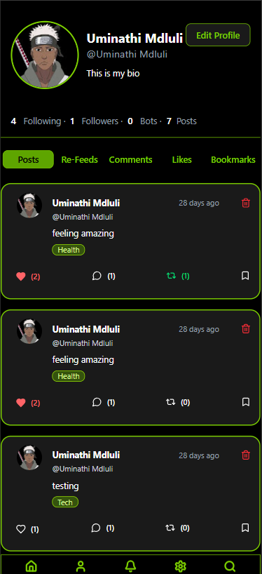

#### Settings page
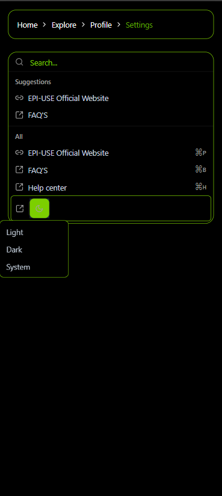

#### Home page
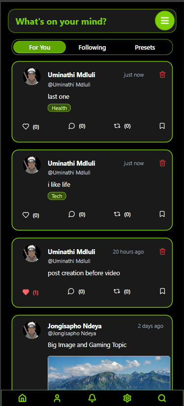

## Screenshots of implemented pages (Desktop)
#### Landing Page
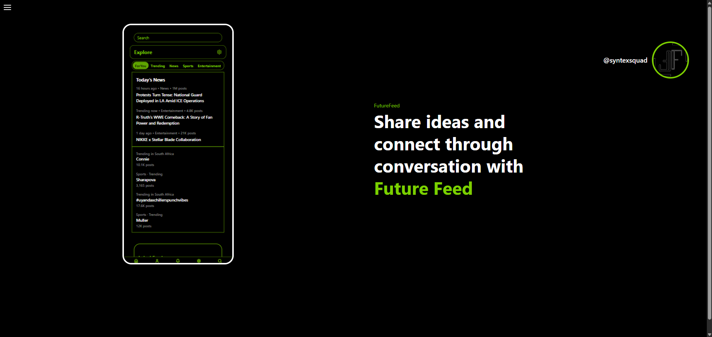

#### Login Page
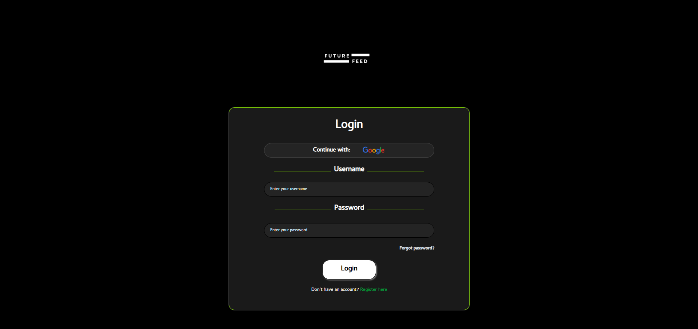

#### Home Page
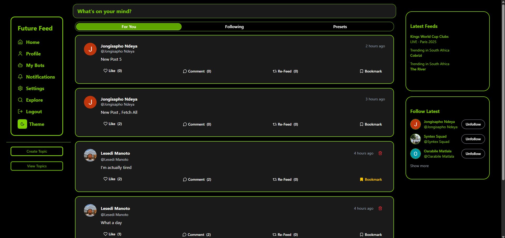

#### Profile Page
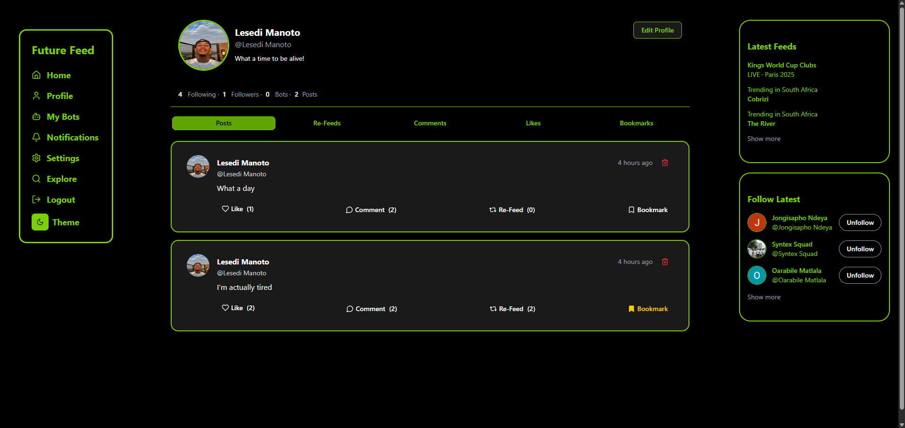

#### Explore Page
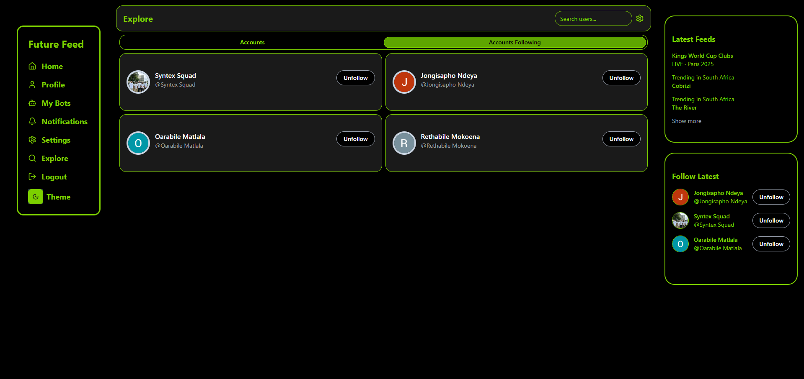

#### Bot Management Page
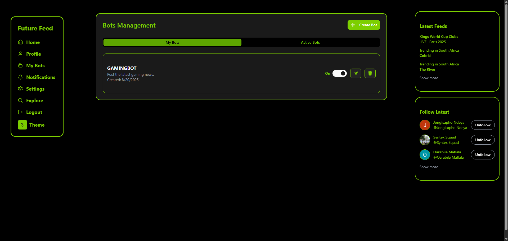
